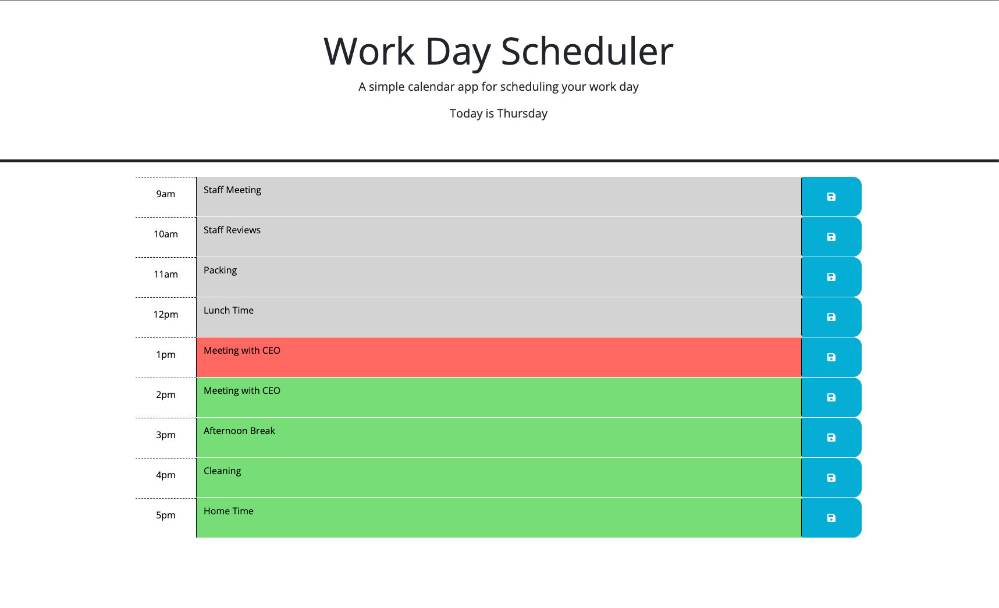

# Work Day Scheduler
https://ryanmcd29.github.io/Work-Day-Scheduler/

## Description
Work day scheduler for planning out a standard work day from 9am to 5pm. Each event can be saved locally and is loaded when the page is loaded.

## Usage
This application is deployed to a URL and can be accessed using an internet browser. 

## Credits

## License
Please refer to the LICENSE in the repo